

This is a [VirtualBox](https://www.virtualbox.org/) image that contains Centos 6.4 with Wakame-vdc peinstalled. This is intended for people to get a first introduction to Wakame-vdc with a minimal amount of configuring required.

[Download the Wakame-vdc demo image.](http://dlc.wakame.axsh.jp/demo/1box/vmdk/1box-lxc.netfilter.x86_64.vmdk.20130709.zip)

## Requirements

Any computer with an x86_64 processor capable of running VirtualBox.

## Setup

Download and unzip the image.

In VirtualBox, click *File* and select *Preferences*.

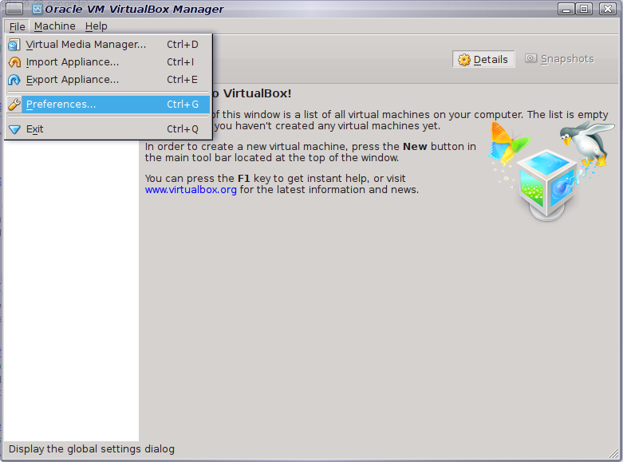

Click on Network and create a new host-only network.

Now click on the screwdriver icon for host-only network settings.

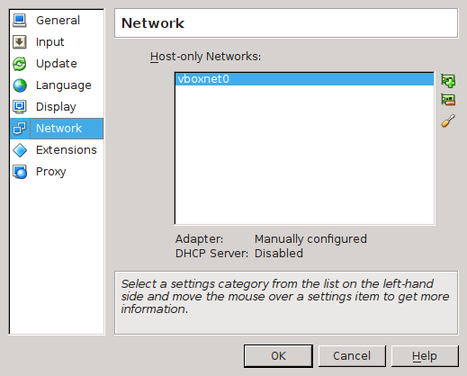

Set the IPv4 subnet to 10.0.2.2/24. Leave IPv6 fields blank.

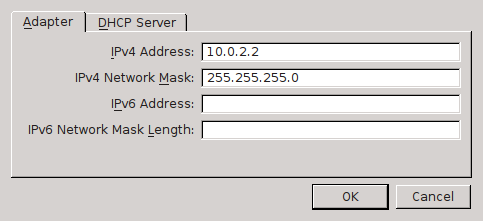

Disable the host-only network's DHCP server.

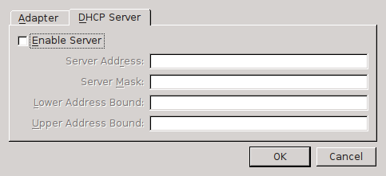

You're done with VirtualBox preferences. Now create a new virtual machine.

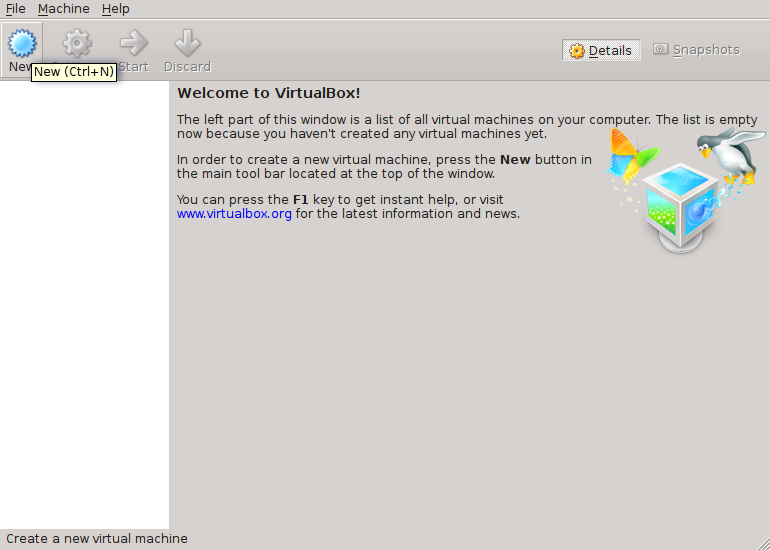

Set the following settings for name and operating system.

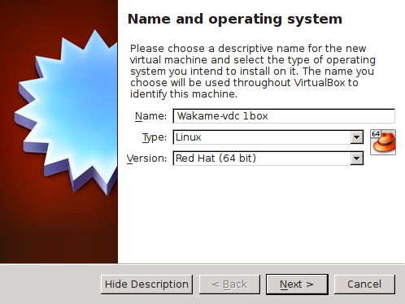

Set the memory size for the VM. 3GB recommended. 1GB minimal.

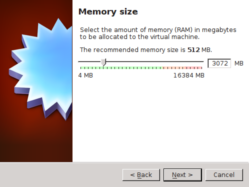

Select *Use an existing virtual hard drive file* and browse to the Wakame-vdc demo image that you have downloaded.

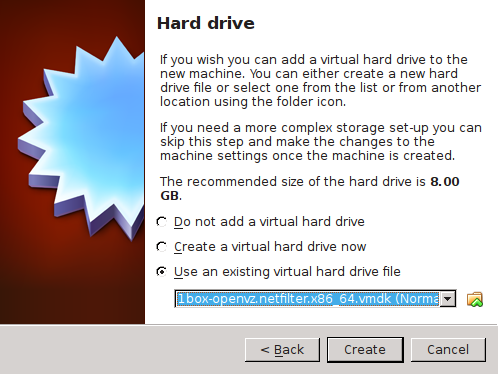

You've now set up VirtualBox VM but you still need to do some extra network settings before Wakame-vdc will work right.

Click *Network* and enable *Adapter 1*. Attach it to the *Host-only Adapter* that you have created above. Make sure to set *Promiscuous Mode* to *Allow All*. This will allow us to make network connections to Wakame-vdc instances.

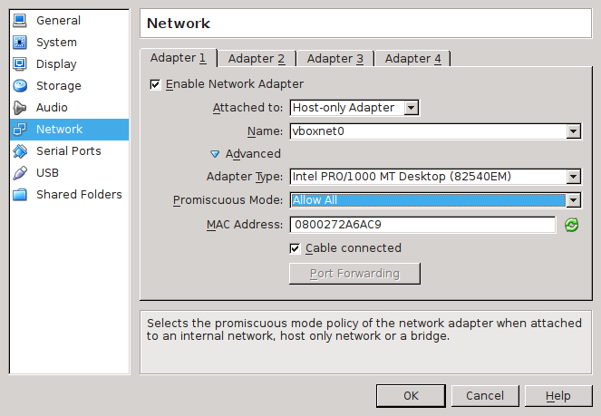

Also enable *Adapter 2* and attach it to an *Internal Network*.

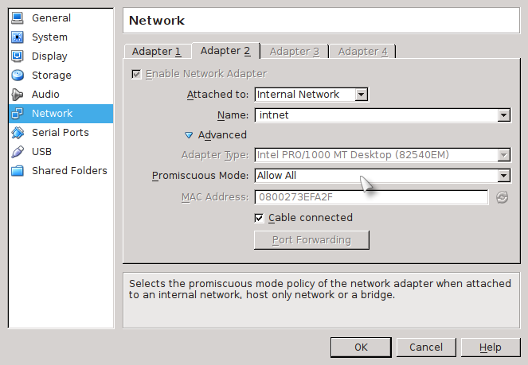

You're done. Start the Wakame-vdc demo image.

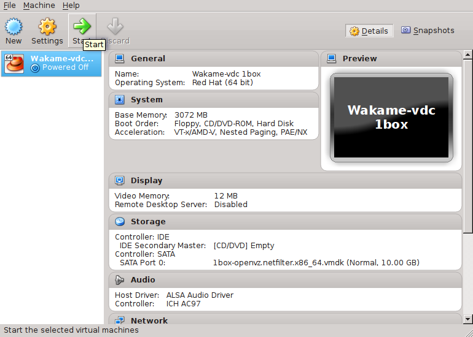

On first boot, the image will take some time to set up several Wakame-vdc services like the MySQL databases.